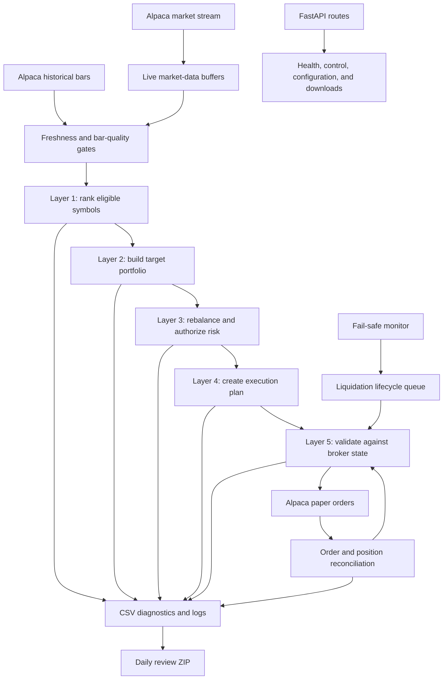

# Stock Trader


Stock Trader is an event-driven algorithmic trading and portfolio-management system built with Python, FastAPI, and Alpaca. It continuously collects market data, ranks a configurable universe of equities, constructs target allocations, applies portfolio and execution controls, and submits orders to an Alpaca paper-trading account.

The project is designed as more than a signal-generation script. It treats automated trading as a stateful production system: broker state is reconciled with local state, decisions are traceable through structured diagnostics, forced liquidations have explicit lifecycles, and daily review packages preserve the evidence needed to evaluate each market session.

The strategy is described here at an architectural level. Exact signal composition, weighting, thresholds, and tuning details are intentionally not published.

> **Current status:** Active paper-trading research and validation. The system is showing promise operationally, but no profitability claim is made. Live trading is a future objective only after substantially more testing demonstrates reliable behavior and sustained risk-adjusted performance that justifies the added risk relative to a passive SPY benchmark.

> **Disclaimer:** This software is an educational and portfolio project, not financial advice. It should not be used with real capital without independent review, extensive testing, and appropriate financial and operational risk controls.

## What the Project Demonstrates

- A layered portfolio-decision pipeline that separates research signals from order execution
- Real-time Alpaca market-data streaming combined with REST-based historical-bar validation
- Multi-symbol ranking, portfolio construction, rebalancing, and broker-aware execution
- Safe-by-default execution controls, market-hours gates, trade throttles, and duplicate-order prevention
- Broker-truth reconciliation for positions, orders, partial fills, restarts, and forced liquidations
- Persistent CSV diagnostics that explain why a cycle, symbol, or order was accepted, blocked, or skipped
- Automated opening and closing account snapshots with SPY and QQQ benchmark context
- Downloadable daily review packages with redacted configuration and source-version metadata
- FastAPI health, administration, authentication, diagnostics, and runtime-configuration routes
- Email and Telegram operational alerts
- Render deployment support and graceful application startup/shutdown
- Focused regression tests for high-risk execution and fail-safe scenarios

## System Architecture



FastAPI owns the application lifespan and exposes the operational interface. Slow startup work is scheduled after the server binds so hosted health checks can succeed while Alpaca clients, the stream, portfolio monitor, trackers, reconciler, alerts, fail-safe worker, and daily-review monitor initialize in the background.

Shared runtime state connects these services, while locks, lifecycle identifiers, broker queries, and reconciliation rules protect the most sensitive transitions from concurrent or stale updates.

## The Five-Layer Portfolio Pipeline

The primary trading path runs as a scheduled, multi-symbol portfolio cycle. Each layer has a narrow responsibility and records enough context for later diagnosis.

### Layer 1: Symbol Ranking

Layer 1 evaluates fresh market data for the configured symbol universe and produces a ranked candidate set. The model combines several categories of market evidence rather than depending on one indicator. Data-quality checks prevent rankings from being treated as actionable when the required bars are stale, incomplete, duplicated, or otherwise unsuitable.

### Layer 2: Portfolio Construction

Layer 2 converts ranked candidates into a target portfolio. It determines which symbols should receive capital and creates target weights under portfolio constraints. This isolates portfolio selection from order mechanics and allows the intended portfolio to be inspected independently of what the broker eventually accepts.

### Layer 3: Rebalancing and Risk Authorization

Layer 3 compares target allocations with the current account and position snapshots. It creates buy, sell, hold, or skip decisions and limits how much quantity and notional value downstream execution may use.

This layer also applies stabilizers intended to reduce unnecessary turnover:

- confirmation requirements around startup and market-open transitions
- recovery handling after process restarts
- target hysteresis so small changes do not cause repeated trading
- rolling limits on trade count and buy, sell, and gross notional
- market-hours and bar-freshness requirements

The result is an authorization plan, not an unconditional order instruction.

### Layer 4: Execution Planning

Layer 4 turns authorized rebalance decisions into a bounded execution plan. Plans carry identifiers, timestamps, expiration rules, and remaining authorized quantities/notional. They can be evaluated in dry-run mode, which is the default, without submitting an order.

### Layer 5: Broker-Aware Execution

Layer 5 is the single path that submits portfolio and forced-liquidation orders. Immediately before submission it rechecks broker positions, available cash, open orders, current execution settings, market status, authorization limits, and fail-safe state.

It prevents duplicate submissions, avoids conflicting orders, clamps quantities to what is currently valid, tracks order metadata, and records why an order was submitted or rejected. Serializing this final step is important because two otherwise valid cycles must not race each other into duplicate exposure.

## Market Data and Decision Gating

The system consumes live Alpaca trade data in a dedicated threaded stream while also requesting historical bars for scheduled portfolio analysis. Live and REST-derived views are compared and logged so data-source differences can be attributed during review.

Before a portfolio cycle becomes executable, gates can require:

- an open market session
- a minimum number or ratio of fresh symbols
- bars within a configured maximum age
- distinct source-bar timestamps
- adequate bootstrap history
- confirmation across multiple bars during sensitive transitions

When a requirement is not met, the system records a skipped cycle and reason rather than silently making a lower-quality decision.

## Risk Controls and Fail-Safe Lifecycle

Risk management is distributed across planning, execution, reconciliation, and monitoring rather than implemented as one final boolean check.

Important protections include:

- paper trading is hard-coded when the Alpaca trading client is initialized
- strategy execution is disabled by default
- regular execution can be restricted to market hours
- rolling trade-count and notional limits
- buy throttling and minimum order-age checks
- duplicate and conflicting open-order detection
- account-level and position-level fail-safe monitoring
- broker position reconciliation after startup and during runtime
- resource and connection monitoring
- graceful shutdown and abnormal-shutdown detection

### Forced Liquidations

Each forced liquidation receives a unique lifecycle identifier and progresses through explicit states such as queued, submitting, submitted, partially filled, waiting for retry, and cleared. Alpaca positions and order status are treated as the source of truth.

This design addresses several difficult failure modes:

- a repeated trigger does not create duplicate liquidation orders
- an unrelated broker update cannot mutate the active liquidation
- partial fills preserve the remaining quantity
- broker rejections and cancellations remain eligible for controlled retry
- a restart with a remaining position restores a retryable lifecycle
- a “filled” order is not considered resolved while the broker still reports a position
- unrelated symbols can continue operating during a symbol-specific fail-safe
- a global fail-safe blocks all new buys until all affected positions resolve

After an actual forced liquidation is confirmed at zero broker position, the symbol enters a configurable reentry cooldown. This helps prevent the strategy from immediately recreating the exposure that the risk system just removed.

Every important transition is appended to `fail_safe_lifecycle.csv` for post-session auditing.

## Reconciliation and State Recovery

The program does not assume that an API submission means an order filled or that in-memory state survived a restart.

At startup and periodically during operation, reconciliation compares local portfolio and order records with Alpaca. Open positions are synchronized, active orders are tracked, stale local assumptions are corrected, and fail-safe lifecycles use current broker quantity and average entry price. This broker-truth approach is central to avoiding duplicate orders and false risk triggers.

## Observability and Daily Review

The project produces structured CSV files for portfolio cycles, bar health, strategy outcomes, target construction, rebalance decisions, execution plans, order decisions, and fail-safe transitions. These files make it possible to answer:

- What data was available?
- Which symbols were considered?
- Why was a symbol selected or rejected?
- What portfolio did the system target?
- Which safety gate changed or blocked the plan?
- What did the broker report before and after execution?
- Did a fail-safe retry, clear, or remain active?

The daily-review monitor captures account, position, and benchmark snapshots around the market session. After the close it builds a ZIP package containing applicable layer diagnostics, trade records, logs, snapshot JSON, a machine-readable daily summary, a manifest, a redacted environment/configuration view, and Git commit/branch metadata.

SPY and QQQ daily bars provide benchmark context for research. Secrets and personally identifying configuration fields are excluded from the packaged configuration.

When developer routes are enabled, authenticated endpoints can download either all current layer diagnostics or the latest daily review package.

## Alerts and Operational Interface

Email and Telegram integrations report lifecycle events and provide an out-of-band view of the deployed service. The repository includes routes for testing alert delivery, checking Telegram status, inspecting stream and layer state, monitoring resources, and reviewing diagnostic output.

The API is grouped under:

| Prefix | Purpose |
| --- | --- |
| `/api/public` | Public route discovery and lightweight public information |
| `/api/auth` | Login, logout, and token verification |
| `/api/admin` | Stream control, health, metrics, layer status, alerts, and runtime configuration |
| `/api/dev` | Detailed diagnostics, CSV/ZIP downloads, dashboards, and development simulations |

Developer routes are disabled unless `ENABLE_DEV_ROUTES=true`. Sensitive routes use the project’s credential or token checks. They should not be exposed publicly without authentication and appropriate network controls.

Useful operational endpoints include:

| Endpoint | Description |
| --- | --- |
| `GET /api/admin/healthz` | Application and service health |
| `GET /api/admin/stream-status` | Market-stream status |
| `GET /api/admin/metrics` | Process resource metrics |
| `GET /api/admin/layer-status` | Current layered-engine state |
| `GET /api/admin/config` | Authenticated runtime configuration |
| `GET /api/dev/diagnostics` | Detailed diagnostic state |
| `GET /api/dev/layers/dashboard` | Layer inspection dashboard |
| `GET /api/dev/layers/all-csv-diagnostics.zip` | Authenticated diagnostic archive |
| `GET /api/dev/daily-review/latest.zip` | Authenticated latest daily review |

FastAPI also provides interactive API documentation at `/docs` and `/redoc`.

## Repository Structure

```text
Stock-Trader/
|-- main.py                   # FastAPI entry point
|-- app_instance.py           # Shared FastAPI application
|-- config/                   # Defaults and runtime configuration
|-- core/                     # Lifespan, startup, shutdown, and shared state
|-- diagnostics/              # Daily reviews and fail-safe audit output
|-- integrations/             # Authentication, email, and Telegram
|-- layers/                   # Five-layer portfolio and execution pipeline
|-- market/                   # Live stream and historical market data
|-- routes/                   # Public, auth, admin, and developer APIs
|-- runners/                  # Scheduled layer and heartbeat monitors
|-- safety/                   # Fail-safe detection and liquidation lifecycle
|-- strategies/               # Higher-level strategy components
|-- trading/                  # Orders, services, portfolio state, reconciliation
|-- tests/                    # Execution, lifecycle, and review regression tests
|-- utils/                    # Shared lifecycle, numeric, symbol, and system tools
|-- render.yaml               # Render service definition
|-- requirements.txt          # Python dependencies
`-- .env.example              # Sanitized configuration template
```

Runtime CSVs, logs, review packages, credentials, and local Alpaca exports are intentionally ignored by Git.

## Safe Defaults

Two settings are especially important:

```dotenv
OLD_STREAM_STRATEGY_ENABLED=false
LAYER4_EXECUTION_ENABLED=false
```

The first leaves the legacy tick strategy in observation-only mode. The second leaves the layered portfolio engine in dry-run planning mode. Set `LAYER4_EXECUTION_ENABLED=true` only when the intended paper account, symbol universe, risk configuration, deployment environment, and alert channels have been verified.

The Alpaca client currently uses `paper=True` in application startup. Changing environment variables alone does not enable live brokerage execution.

## Local Setup on Windows

### Prerequisites

- Python 3.10
- An Alpaca paper-trading account and API credentials
- Optional SMTP/email and Telegram bot credentials

### Installation

```powershell
git clone https://github.com/JRaptor11/Stock-Trader.git
cd Stock-Trader
py -3.10 -m venv venv
.\venv\Scripts\Activate.ps1
python -m pip install --upgrade pip
pip install -r requirements.txt
Copy-Item .env.example .env
```

Edit `.env` with the credentials for your own services. Never commit that file.

Start the application:

```powershell
python main.py
```

Or run Uvicorn directly:

```powershell
uvicorn main:app --host 0.0.0.0 --port 8000 --reload
```

Then open:

- Swagger UI: <http://localhost:8000/docs>
- ReDoc: <http://localhost:8000/redoc>
- Health: <http://localhost:8000/api/admin/healthz>

Startup continues in the background for several seconds after the web server binds. Review the application logs to confirm that Alpaca clients, the market stream, trackers, layer monitor, reconciler, fail-safe worker, daily review monitor, and alert integrations initialized successfully.

## Environment Configuration

Copy `.env.example` to `.env` and replace placeholders. The most important groups are:

| Variable | Purpose |
| --- | --- |
| `API_KEY`, `SECRET_KEY` | Alpaca paper-account credentials |
| `ALPACA_URL` | Alpaca paper API URL used by integrations/configuration |
| `SYMBOL` | Comma-separated research universe |
| `HEALTH_USERNAME`, `HEALTH_PASSWORD` | Required operational-route credentials |
| `EMAIL_*` | Optional SMTP alert configuration |
| `TELEGRAM_*` | Optional Telegram alert configuration |
| `LAYER4_EXECUTION_ENABLED` | Enables paper-order submission when true |
| `ENABLE_DEV_ROUTES` | Mounts detailed diagnostic/development routes |
| `LAYER3_MARKET_HOURS_ONLY` | Restricts normal layered execution to market hours |
| `FAIL_SAFE_REENTRY_COOLDOWN_SECONDS` | Blocks immediate repurchase after liquidation |
| `LAYER_CSV_DIR` | Optional directory for runtime diagnostic CSVs |

The template documents additional data-quality, restart-recovery, hysteresis, and rolling-limit switches. Defaults in the repository are deliberately conservative, but configuration should still be reviewed before every deployment.

## Running Tests

The regression suite focuses on the highest-risk state transitions:

- deduplicated fail-safe queueing and submission
- partial fills, cancellations, broker rejections, and retry cooldowns
- restart recovery and reconciliation
- global versus symbol-specific buy blocking
- exact lifecycle/order correlation
- concurrency protection against duplicate submissions
- broker average-entry-price validation
- post-liquidation reentry cooldown
- daily snapshot capture, redaction, manifest generation, and ZIP packaging

Run all tests from the repository root:

```powershell
python -m unittest discover -s tests -v
```

## Historical Replay and ML Dataset Preparation

The repository includes an offline, shadow-only historical replay workflow. It
feeds completed five-minute bars through the same ranking and portfolio-planning
components used by the layered application, maintains independent portfolio
state for each research strategy, and executes eligible decisions at the next
bar's opening price. Configurable spread, slippage, commission, whole-share,
cash, hysteresis, and rolling-trade constraints are included so historical
results do not assume cost-free or same-bar execution.

Input is a long-form CSV with one row per symbol and timestamp. Required columns
are `timestamp`, `symbol`, `open`, `high`, `low`, `close`, and `volume`.
`trade_count` and `vwap` are optional. Timestamps must include a UTC offset, and
each symbol/timestamp pair must be unique. If SPY is present, it is treated as
benchmark context by default rather than as a candidate security.

Example:

```powershell
python -m research.historical_replay historical_5m_bars.csv `
  --output replay_output `
  --symbols AAPL,AMD,AMZN,AVGO,COST,GOOGL,META,MSFT,NVDA,TSLA `
  --benchmark-symbol SPY `
  --spread-bps 1 `
  --slippage-bps 1
```

The output contains portfolio cycles, decisions, simulated orders, strategy
summaries, chronological walk-forward folds, and an ML-ready feature/outcome
dataset. Outcome columns are calculated only from later timestamps and are kept
separate from decision-time features. The manifest records the source-file hash
and replay configuration for reproducibility.

Replay parity can then be measured against a downloaded paper-session package:

```powershell
python -m research.replay_parity `
  replay_output\replay_cycles.csv `
  layer_research_strategy_cycles.csv `
  --output replay_output\replay_parity.json
```

The parity report aligns each strategy by source-bar timestamp and reports mean,
maximum, and final differences in equity, turnover, trade count, and drawdown.
Material differences should be explained before historical results are used for
model selection.

Historical replay remains a research tool rather than evidence of live-trading
readiness. Results should be validated against recorded paper sessions and
evaluated chronologically across multiple market regimes before model training
or strategy promotion.

## Deploying on Render

The repository contains `render.yaml`, `runtime.txt`, and `build.sh` for a Render web service. The service starts with:

```text
uvicorn main:app --host 0.0.0.0 --port $PORT
```

Recommended deployment workflow:

1. Fork or connect the GitHub repository to Render.
2. Create a web service from `render.yaml`.
3. Add the required variables from `.env.example` in the Render environment dashboard.
4. Keep `LAYER4_EXECUTION_ENABLED=false` for the first deployment.
5. Deploy and confirm `/api/admin/healthz`, startup logs, Alpaca connectivity, stream state, and alert delivery.
6. Review dry-run layer diagnostics across complete market sessions.
7. Enable paper execution only after confirming the selected account, symbols, safeguards, and downloadable diagnostics.

Runtime files on a hosted instance may not be durable across redeployments or instance replacement. Daily review packages should therefore be downloaded after each session or moved to durable external storage in a future revision.

## Market-Day Operating Workflow

A typical validation session follows this sequence:

1. Confirm the deployed Git commit and Render environment settings.
2. Verify that the service, stream, Alpaca account, and alert channels are healthy.
3. Start in dry-run mode after any meaningful strategy or execution change.
4. Monitor layer status and decision reasons during market hours.
5. Confirm that opening and closing snapshots are created.
6. Download the daily review ZIP and CSV diagnostics after the close.
7. Compare intended targets, submitted orders, fills, positions, risk events, and SPY/QQQ context.
8. Add regression tests for any unexpected lifecycle or broker-state sequence before the next session.

## Current Limitations

- The system remains in paper-trading validation and is not approved for live capital.
- The available market-day sample is still too small to support profitability conclusions.
- There is not yet evidence of sustained outperformance versus buying and holding SPY after accounting for risk, turnover, slippage, and changing market regimes.
- Historical replay currently models next-bar fills and configurable costs but
  still requires validation against a larger collection of recorded broker
  sessions before its results can be treated as production-equivalent.
- Runtime history is stored primarily in CSV, JSON, and logs rather than a durable transactional database.
- Render filesystem output may be ephemeral unless artifacts are downloaded or exported.
- External availability depends on Alpaca, IEX data, SMTP, Telegram, network connectivity, and hosted-service uptime.
- The application uses in-process shared state and is designed for a single active service instance, not horizontal multi-instance execution.
- Some development endpoints intentionally permit simulated actions and must remain disabled or tightly protected in public deployments.
- Automated test coverage is concentrated on execution safety and lifecycle correctness rather than every strategy and API path.

## Roadmap

Planned areas of work include:

- longer paper-trading validation across different market regimes
- formal SPY-relative benchmarking with risk and drawdown analysis
- expanded replay-parity, walk-forward, and parameter-stability testing
- durable storage for orders, decisions, snapshots, and review artifacts
- expanded integration and fault-injection testing
- a production monitoring dashboard
- improved deployment persistence and artifact retention
- formal live-trading readiness criteria and staged rollout controls

Live trading will be considered only after the system demonstrates robust operational behavior and a sufficiently tested advantage over a passive benchmark. That transition would require additional controls, review, and deliberately separate credentials and deployment procedures.

## Author

Created and maintained by [JRaptor11](https://github.com/JRaptor11).

## License

This project is available under the [MIT License](LICENSE).
